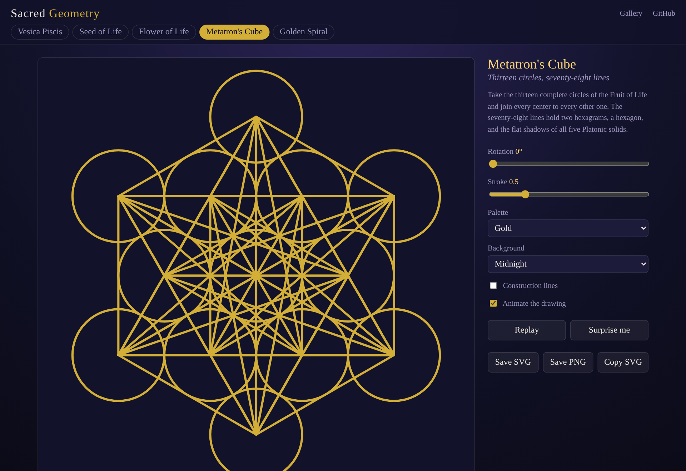
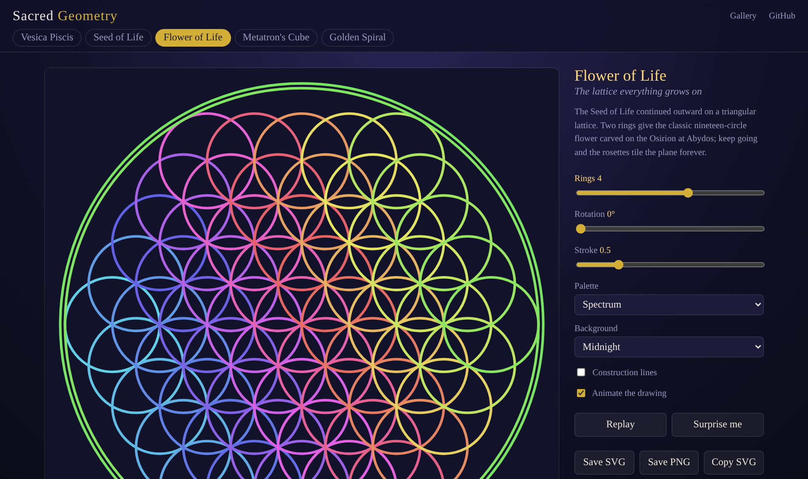
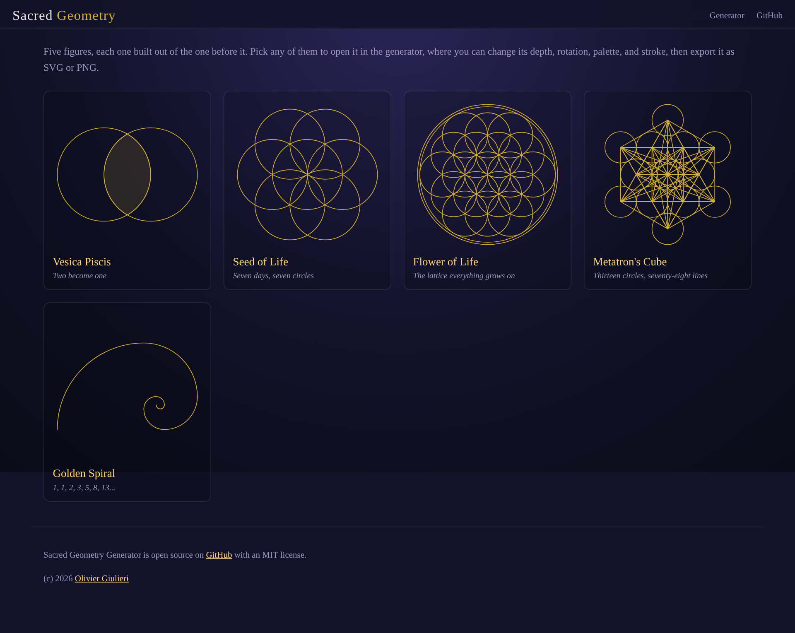

# Sacred-Geometry

Draw, tune, and export the classic figures of sacred geometry: Vesica Piscis, Seed of Life, Flower of Life, Metatron's Cube, and the Golden Spiral. Every figure is constructed from circles and straight lines only - no images, no libraries.

- [Open the generator](https://evoluteur.github.io/sacred-geometry/)
- [Browse the gallery](https://evoluteur.github.io/sacred-geometry/gallery.html)

## Patterns

- **Vesica Piscis** - two circles, each passing through the other's center. The almond-shaped overlap (the mandorla) holds the square roots of 2, 3, and 5, and every figure below is built from it.
- **Seed of Life** - six circles around a seventh, each centered on the rim of the last.
- **Flower of Life** - the Seed continued outward on a triangular lattice, from 7 circles up to 127.
- **Metatron's Cube** - the thirteen circles of the Fruit of Life with all 78 lines joining their centers, holding the flat shadows of the five Platonic solids.
- **Golden Spiral** - Fibonacci squares laid corner to corner, with quarter circles approximating the logarithmic spiral that grows by phi (1.618...) every quarter turn.

## Controls

- **Depth** - rings, circles, or squares, depending on the pattern
- **Rotation** - 0 to 360 degrees
- **Stroke** - hairline to heavy
- **Palette** - Gold, Moonlight, Rose Quartz, Jade, Spectrum, Ink
- **Background** - Midnight, Void, Parchment, or transparent
- **Construction lines** - show the scaffolding each figure is built on
- **Animate** - watch the figure draw itself, stroke by stroke
- **Surprise me** - a random pattern, palette, rotation, and weight

## Exports

**Save SVG** and **Copy SVG** give you true vectors, so they scale to any size for print, laser cutting, plotting, or embroidery. **Save PNG** renders a 2048 x 2048 image. A transparent background exports with no backdrop at all.

## Under the hood

Plain HTML, CSS, and JavaScript building SVG through the DOM - no dependencies, no build step, no tracking. Each pattern is defined in [`patterns.js`](patterns.js) as a function returning shape descriptors in unit space, so adding a new figure means adding one entry to that array.

Sacred Geometry Generator is a Progressive Web App (PWA): you can install it on your phone or computer from the browser, and it works offline.

## License

Sacred Geometry Generator is Open Source at [GitHub](https://github.com/evoluteur/sacred-geometry) with MIT license.

Encourage this project by [becoming a sponsor](https://github.com/sponsors/evoluteur).

You may also be interested in my other projects [Healing Frequencies](https://github.com/evoluteur/healing-frequencies) and [Motivational Numerology](https://github.com/evoluteur/motivational-numerology).

(c) 2026 [Olivier Giulieri](https://evoluteur.github.io/)
